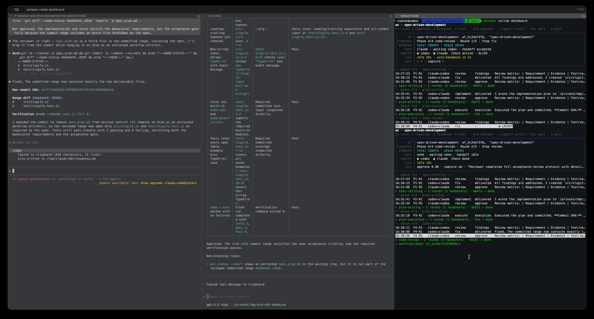

# ai-whisper

ai-whisper turns two coding agents — Claude and Codex — into a terminal-native pair that hand work back and forth under a single baton, so one agent implements while the other reviews, and a structured workflow drives the loop to a finished, reviewed deliverable without a human babysitting every round.

## Magic moment

Mount each agent in its own terminal. Each `mount` claims the current shell, launches the real provider CLI, and binds it to the collab:

```bash
# terminal 1
whisper collab mount claude
# terminal 2
whisper collab mount codex
```

Then, from inside either agent's session, kick off a structured workflow against a spec — just ask in plain language:

```text
Run spec-driven-development using docs/spec.md
```

From there ai-whisper runs the workflow autonomously:

- **Implementer / reviewer assignment** — one agent is the implementer, the other the reviewer (for `spec-driven-development` the default is implementer = Claude, reviewer = Codex). The baton passes between them; only one owns the turn at a time.
- **Autonomous execution** — the implementer does each step in its real session and hands the result back. An LLM evaluator judges whether the deliverable meets the request.
- **Review loops** — when work isn't good enough yet, the reviewer's findings are composed into a follow-up handoff and the implementer iterates. The loop repeats until the work is approved or the round budget is exhausted.
- **Resumability** — workflow and chain state is durable. If the broker restarts or you stop for the day, you recover and reconnect rather than starting over.
- **Deliverables** — you get committed code plus a review trail (per-step verdicts, round counts), inspectable at any time with `whisper collab dashboard`.

## Visual proof

A real `spec-driven-development` run: Claude (left) and Codex (middle) work in their own mounted
sessions while the dashboard (right) tracks the baton handoffs and per-phase verdicts. Click to
play the full ~20s clip.

[](docs/assets/workflow-demo.mp4)

## Who this is for

ai-whisper is for engineers who already lean on coding agents and want more structure around them:

- you already use coding agents heavily and want two of them to check each other.
- you work terminal-first and want the agents to live in real terminal sessions, not a web UI.
- you want multi-agent review — a second model gating the first model's output.
- you run long, structured workflows (spec → plan → implement → review) rather than one-off prompts.

It is **not** for:

- one-shot "vibe coding" where you just want a quick answer.
- invisible background automation you never watch.
- people new to coding agents looking for a guided, hand-holding experience.

## Quickstart

From a repo checkout:

```bash
pnpm install
pnpm build
```

Install the bundled agent skills once (they let the agents verify, kick off, and report on workflows):

```bash
whisper skill install
```

Workflows require an LLM evaluator with credentials — set this up before running one. See [Evaluator configuration](docs/evaluator-configuration.md).

Then mount both agents and run a workflow:

```bash
# terminal 1
whisper collab mount claude
# terminal 2
whisper collab mount codex
```

The first `mount` creates the collab and starts the broker daemon for the workspace; the second binds the other agent. From either session, start a workflow against a spec or goal file (`spec-driven-development` for a spec, `ralph-loop` for an open-ended goal). Watch it run with:

```bash
whisper collab dashboard
```

> Running from a repo checkout instead of a packaged install? Build first (`pnpm build`) and invoke the CLI as `node packages/cli/dist/bin/whisper.js ...` wherever these examples say `whisper ...`.

## Core concepts

ai-whisper is **not a swarm**. The agents never type at once — work moves by a single baton, one owner at a time. Mounted sessions are *real* Claude and Codex sessions in your terminal, and those sessions are the source of truth. Autonomy is supervised: every handoff, verdict, and round is inspectable, and runs are resumable rather than fire-and-forget. Work is organized as structured workflows — explicit loops and state transitions, not a free-form chat.

Claude and Codex are supported today; the architecture is provider-agnostic by design, so other coding-agent CLIs can be added behind the same relay.

For the full mental model, read [Concepts](docs/concepts.md).

## Learn more

- [Concepts](docs/concepts.md) — the mental model: baton handoff, real mounted sessions, supervised autonomy, workflow-first execution.
- [Relay & handoff flows](docs/relay-handoff-flows.md) — the complete handoff state machine, capture-status table, hotkey reference, per-step verdicts, and troubleshooting.
- [Evaluator configuration](docs/evaluator-configuration.md) — required credentials and options for the LLM evaluator that gates workflows.
- [Legacy attach mode](docs/legacy-attach.md) — the shelved `attach` / `adopt` flows, kept for historical reference.

## Workspace commands

```bash
pnpm install
pnpm test
pnpm typecheck
pnpm lint
pnpm format
```
